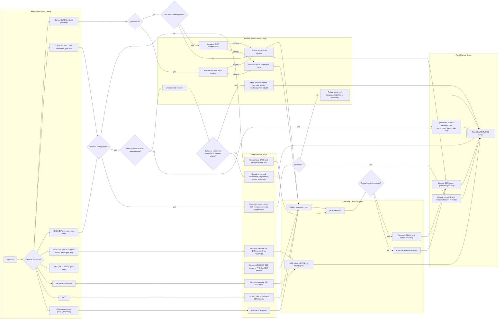

# ultrahdr-pwa-svelte

A vibe coded PWA for creating HDR Gain Map JPEG images.

## Instructions

Access the live version here to process your photos: [https://sturmen.github.io/ultrahdr-pwa-svelte/](https://sturmen.github.io/ultrahdr-pwa-svelte/)

## What is HDR?

| HDR | SDR |
| --- | --- |
|  |  |

Don't think of the "old" HDR, which is [totally different.](https://gregbenzphotography.com/hdr/#oldVsNewHDR)

More information: https://gregbenzphotography.com/hdr/

## Scope

This is an attempt at a cross-platform way to enhance SDR images into the widely-compatible JPEGR (aka UltraHDR JPEG, aka JPEG with a gain map) format. The goal is that users may have an SDR image that they enjoy, and they use this progressive web app to add an enhancement layer that improves the image but does not alter the original nor introduce compatibility issues.

## GMNet Gain-Map Generation

Gain-map generation is handled by [GMNet](https://github.com/qtlark/GMNet).

## Processing Pipelines

`quality`, `stripExif`, and `maxContentBoost` primarily affect encoding quality and metadata, not the top-level route through `generated`, `preserved`, or `hdr-intent`. Preserved gain maps keep their source metadata unless `discardGainMap=true` forces regeneration. The `preserve-with-rotation` branch covers preserved inputs that still need auto-rotation, explicit rotation, or preserved-component resize/alignment work before the final rebuild. Every branch ends in an UltraHDR JPEG output.

## Testing

- Desktop regression: `npm run test:e2e`
- Mobile emulation (iOS + Android): `npm run test:e2e:mobile`

## Features

- Free and open source (MIT license)
- Completely local processing. No cloud costs, or any costs at all.
- Cross-platform support across web browsers. Tested with Chrome 144.
- In-browser AI-powered state-of-the-art gain map generation using GMNet through ONNX
- Batch support
- Rotation support
- EXIF preservation
- Configurable HDR headroom
- ISO 21496-1 Metadata Encoding
- Convert HEIC/HEIF (iPhone, Samsung Galaxy) to UltraHDR JPEG using the original gain map
- Convert older UltraHDR JPEGs (Hasselblad X2D II 100C, Sigma BF) to ISO 21496-1 using the camera's gain map embedded in the image
- Convert HDR PQ input (.HIF format from Canon cameras) to UltraHDR JPEG with tone mapping to SDR.

## Special thanks

- Google for [libultrahdr](https://github.com/google/libultrahdr)
- GMNet authors: Yinuo Liao and Yuanshen Guan and Ruikang Xu and Jiacheng Li and Shida Sun and Zhiwei Xiong!
- @gregbenz for all his work [evangelizing HDR photography](https://gregbenzphotography.com/hdr/)
- OpenAI, Anthropic, and Google for the AI models that actually wrote this entire repo.
