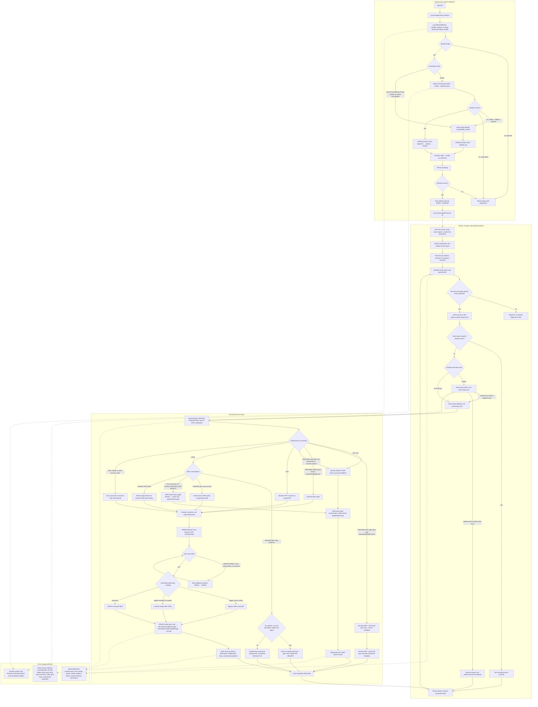

# ultrahdr-pwa-svelte

A vibe coded PWA for creating HDR Gain Map JPEG images.

## Instructions

Access the live version here to process your photos: [MakeBetterJPEGs.com](https://makebetterjpegs.com/)

## What is HDR?

| HDR | SDR |
| --- | --- |
|  |  |

Don't think of the "old" HDR, which is [totally different.](https://gregbenzphotography.com/hdr/#oldVsNewHDR)

More information: https://gregbenzphotography.com/hdr/

## Scope

This is an attempt at a cross-platform way to enhance SDR images into the widely-compatible JPEGR (aka UltraHDR JPEG, aka JPEG with a gain map) format. The goal is that users may have an SDR image that they enjoy, and they use this progressive web app to add an enhancement layer that improves the image but does not alter the original nor introduce compatibility issues.

## GMNet Gain-Map Generation

Gain-map generation is handled by [GMNet](https://github.com/qtlark/GMNet).

## Processing Pipelines

The runtime path is part of processing: startup validates or repairs the offline runtime bundle before the converter UI loads, then chooses worker or main-thread execution. Worker init runs a GMNet provider chain (WebGPU → WebGL → WASM) with provider verification and a smoke-run inference test; main-thread compatibility mode uses WASM only. Queue execution is single-claim per item, guarded by a tab lock, queue launch lease, and queue-scoped process-request dedupe.

`discardGainMap` is the main option that changes the top-level route: preserved gain maps stay on the preserved path when possible, while discarded or missing gain maps route through GMNet generation. `quality`, `stripExif`, and `maxContentBoost` primarily affect encoding and metadata, not whether the item is `generated`, `preserved`, or `hdr-intent`. HDR-intent inputs (`.hif` files, HEIC with Rec.2020 PQ/HLG metadata, JPEG with CICP primaries=9 + transfer=16/18) bypass GMNet entirely and encode directly via libultrahdr's API-0 path. Peak-memory release hooks zero or detach JS-side buffers after each wasm heap copy to reduce MobileSafari OOM pressure. Every successful branch ends in an UltraHDR JPEG output and emits structured diagnostics breadcrumbs for offline debugging.

## Testing

- Desktop regression: `npm run test:e2e`
- Mobile emulation (iOS + Android): `npm run test:e2e:mobile`

## Features

- Free and open source (MIT license)
- Completely local processing. No cloud costs, or any costs at all.
- Cross-platform support across web browsers. Tested with Chrome 144.
- In-browser AI-powered state-of-the-art gain map generation using GMNet through ONNX
- Batch support
- Rotation support
- EXIF preservation
- Configurable HDR headroom
- ISO 21496-1 Metadata Encoding
- Convert HEIC/HEIF (iPhone, Samsung Galaxy) to UltraHDR JPEG using the original gain map
- Convert older UltraHDR JPEGs (Hasselblad X2D II 100C, Sigma BF) to ISO 21496-1 using the camera's gain map embedded in the image
- Convert HDR PQ input (.HIF format from Canon cameras) to UltraHDR JPEG with tone mapping to SDR.

## Special thanks

- Google for [libultrahdr](https://github.com/google/libultrahdr)
- GMNet authors: Yinuo Liao and Yuanshen Guan and Ruikang Xu and Jiacheng Li and Shida Sun and Zhiwei Xiong!
- @gregbenz for all his work [evangelizing HDR photography](https://gregbenzphotography.com/hdr/)
- OpenAI, Anthropic, and Google for the AI models that actually wrote this entire repo.
